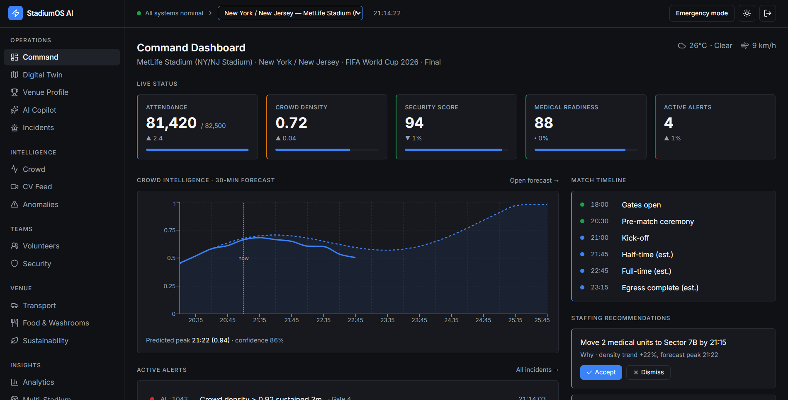
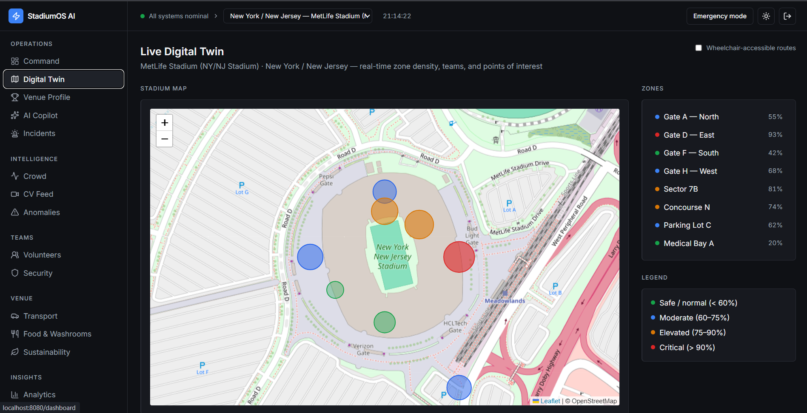

# StadiumOS AI

StadiumOS AI is a FIFA World Cup 2026 stadium operations dashboard built with TanStack Start, TanStack Router, Supabase, Vite, React, and TypeScript. It is designed as a command-center style app for organizers, security, medical, transport, volunteers, sustainability, and analytics teams.

The project is intentionally demo-driven: most operational screens are powered by simulated datasets in `src/lib/mock-data.ts`, while auth and a few integrations use real services or live feeds.

## What is in the project

### Core product areas

The app is split into a public auth flow and an authenticated operations shell.

- Public landing redirect at `/` that sends signed-in users to the dashboard and unauthenticated users to auth.
- Authentication page at `/auth` for sign in and sign up.
- Main authenticated shell with left navigation, venue selector, theme toggle, emergency mode toggle, and sign out.
- Command dashboard with KPIs, alerts, staffing recommendations, and crowd forecast.
- Digital twin map with live zone density and selectable stadium location.
- Venue profile with stadium details, images, match schedule, and stadium switching.
- AI copilot chat grounded in the selected venue and live operational context.
- Incident command center for open, responding, and resolved incidents.
- Crowd intelligence view with density forecasting and zone comparisons.
- Computer vision feed with flagged detections and camera grid.
- Anomaly detection page for statistically unusual patterns.
- Volunteers management page with roster, skills, availability, and detail modal.
- Security operations page with alerts, patrol units, CV events, and CCTV coverage.
- Transportation intelligence page with parking, transit, shuttles, closures, and egress forecast.
- Food, seating, and nearby page with concessions, washrooms, restaurants, delivery, and seating occupancy.
- Sustainability dashboard with energy, water, waste, and carbon trend charts.
- Analytics and reports page with attendance charts and generated summary content.
- Multi-stadium comparison page for venue-wide status.
- Shift handoff log for continuity notes.
- Notifications page for schedule alert rules and feed-driven notifications.

### Routes

The route structure is defined in `src/routes`.

- `src/routes/__root.tsx` sets up the app shell, theme provider, venue provider, query client, document metadata, fonts, and Leaflet CSS.
- `src/routes/index.tsx` redirects to `/dashboard` or `/auth` depending on session state.
- `src/routes/auth.tsx` implements sign in and sign up.
- `src/routes/_authenticated/route.tsx` protects all private routes and renders the main app shell.
- Feature routes live under `src/routes/_authenticated/` and correspond to the pages listed above.

### UI and shared components

- `src/components/app-shell.tsx` contains the sidebar, top bar, emergency mode banner, venue switcher, and sign-out logic.
- `src/components/primitives.tsx` provides the shared cards, KPI widgets, rows, status dots, labels, and badges used across screens.
- `src/components/ui/*` contains the reusable UI primitives generated from the design system.

## Authentication flow

Auth is handled by Supabase.

### Sign up

On `/auth`, the user can switch to sign-up mode and provide:

- full name
- role
- email
- password

When sign up runs, the app calls `supabase.auth.signUp()` with:

- `email`
- `password`
- `emailRedirectTo` set to `/dashboard`
- user metadata containing `full_name` and `role`

After a successful sign up, the UI shows a success toast and navigates to the dashboard.

### Sign in

On `/auth`, the user can sign in with email and password using `supabase.auth.signInWithPassword()`. After success, the app navigates to `/dashboard`.

### Session protection

Authenticated routes are guarded in `src/routes/_authenticated/route.tsx` using `supabase.auth.getUser()`. If no user is found, the app redirects back to `/auth`.

### Role display

The shell reads the current user and queries the `user_roles` table for the role value. That role is shown in the sidebar footer.

## APIs and server functions

This project does not use a classic REST API for most screens. Instead it mixes Supabase auth, TanStack Start server functions, and one external schedule feed.

### Supabase

Supabase is used for authentication and session state.

Files involved:

- `src/integrations/supabase/client.ts`
- `src/integrations/supabase/auth-middleware.ts`
- `src/integrations/supabase/auth-attacher.ts`
- `src/integrations/supabase/types.ts`

Environment variables:

- `VITE_SUPABASE_URL`
- `VITE_SUPABASE_PUBLISHABLE_KEY`
- `SUPABASE_URL`
- `SUPABASE_PUBLISHABLE_KEY`

### AI copilot API

`src/lib/ai-copilot.functions.ts` defines `askCopilot`, a TanStack Start server function that:

- validates the request with Zod
- builds a system prompt from the selected venue and operational context
- sends the request to the Lovable AI gateway at `https://ai.gateway.lovable.dev/v1/chat/completions`
- uses the `LOVABLE_API_KEY` environment variable

The copilot is designed to answer operational questions, draft multilingual announcements, and suggest actions based on the live control-room context.

### Schedule feed API

`src/lib/schedule.functions.ts` defines `fetchSchedule`, a server function that:

- calls the SportsDB endpoint for upcoming league events
- normalizes the results into the local `Match` shape
- maps venue strings back to stadium IDs when possible
- falls back to the built-in schedule data if the upstream API is unavailable or empty

The current feed source is:

- `https://www.thesportsdb.com/api/v1/json/3/eventsnextleague.php?id=4429`

### Request and error handling

`src/start.ts` wires TanStack Start middleware and renders a custom error page for non-status-code exceptions.

## Map and digital twin

The map experience lives in `src/routes/_authenticated/digital-twin.tsx`.

What it uses:

- `react-leaflet` and `leaflet`
- dynamic imports so Leaflet only loads on the client
- OpenStreetMap tiles
- zone circles sized and colored by density and severity
- venue-based shifting of zone coordinates so the same zone model can follow the selected stadium

The app loads the Leaflet CSS from the root document head and uses the selected venue from `src/lib/venue-context.tsx` to center the map.

## Data model

Most dashboards use static demo data from `src/lib/mock-data.ts`.

That file includes:

- host stadium list and coordinates
- match schedule
- KPIs and alerts
- zone density data
- incident records and timelines
- computer-vision events
- volunteer rosters
- transport, parking, shuttle, and road closure data
- concessions and washroom data
- sustainability metrics
- anomalies
- shift log entries
- staffing recommendations
- nearby restaurants and delivery partners
- seating sections and occupancy
- security units and CCTV coverage

The data is intentionally simulated so the UI feels like a live command room without depending on real tournament systems.

## Main features by screen

### Dashboard

- live attendance, crowd density, security score, medical readiness, and active alerts
- weather summary
- 30-minute crowd forecast chart
- staffing recommendations with accept and dismiss actions
- data-source health list

### Venue profile

- stadium images
- capacity and attendance KPIs
- venue facts like surface, roof, architect, address, and home teams
- scheduled matches for the selected venue
- switch between all host stadiums

### Digital twin

- stadium map centered on the selected venue
- zone density circles and tooltip details
- selectable zone list and detail panel
- accessibility toggle for wheelchair routes

### AI copilot

- chat UI with markdown responses
- suggested prompts for common operations questions
- venue-aware grounding
- microphone button placeholder for future voice input

### Incidents

- incident search and status filters
- incident detail panel with responders and timeline
- close incident action
- dispatch, announcement, and escalation actions

### Crowd intelligence

- overall density and forecast KPIs
- density forecast chart
- zone density comparison chart

### Security

- live alert feed
- patrol unit roster
- CV event list
- CCTV grid with online/offline status

### Transportation

- parking utilization cards
- transit load list
- shuttle route table
- road closure list
- rideshare and micro-mobility summary
- egress forecast chart

### Food and washrooms

- live seating occupancy by section
- concession water, food, and queue status
- washroom wait and cleaning times
- nearby restaurants with ratings, ETA, and price
- delivery partner cards

### Sustainability

- energy, water, waste, and carbon KPIs
- trend chart against baseline

### Analytics

- attendance history chart
- generated executive summary content
- retrospective sections for operations review

### Multi-stadium

- at-a-glance host venue comparison
- occupancy, incidents, and risk posture per stadium

### Shift log

- concise running log for handoff and continuity

### Notifications

- live schedule feed syncing
- notification rules
- automatic alerts when kickoff time or schedule changes are detected
- fallback handling when the external feed fails

### Volunteers

- searchable volunteer roster
- filters for availability and assignment
- detailed profile modal
- dispatch and reassignment actions

### Anomalies

- unusual-pattern detection separate from rule-based alerts

### CV feed

- flagged computer-vision detections
- camera grid

## Tech stack

- React 19
- TypeScript
- Vite
- TanStack Start
- TanStack Router
- TanStack Query
- Supabase
- Recharts
- Leaflet and react-leaflet
- Lucide React icons
- Sonner toasts
- Zod validation
- Tailwind CSS v4

## Design system and styling

The app uses a custom visual system with shared primitives, CSS variables, and a command-center layout. The root route imports global styles and Inter, and the shell keeps a persistent sidebar and top bar across authenticated pages.

## How to run it

From the project root:

1. `npm install`
2. `npm run dev`

The dev server runs at `http://localhost:8080/` by default.

### Build

To verify production output:

1. `npm run build`

## Notes

- This is a demo application with simulated operational data in many areas.
- Real auth depends on Supabase environment variables being present.
- The AI copilot depends on `LOVABLE_API_KEY`.
- The schedule view can fall back to local data when the external feed is unavailable.